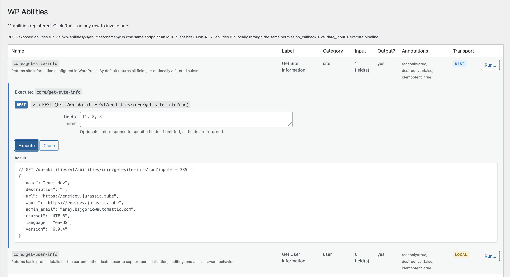

# WP Abilities Viewer

A diagnostic plugin for developers working with the WordPress Abilities API
(WP 6.9+). Adds **Tools → WP Abilities** listing every registered ability,
and lets an admin invoke each one with a generated input form.

Each row shows the ability's name, label, category, input-field count, whether
it declares an output schema, its annotations (readonly / destructive /
idempotent), and which transport will run the invocation:

- **REST** badge — calls `POST /wp-abilities/v1/abilities/<name>/run` (or
  `GET` for readonly abilities) — the same endpoint an MCP client hits.
- **local** badge — for abilities registered with `show_in_rest: false`.
  Runs in-process via the same `normalize_input → validate_input →
  check_permissions → execute` pipeline.

The result panel shows the method, path, elapsed time, and the raw JSON
response (or `WP_Error`) returned by the ability.

## Why you want it

- Verify which abilities a plugin actually registers on a live site.
- Invoke an ability end-to-end — no curl, no Postman, no auth plumbing.
- See structured errors from `validate_input` and `check_permissions` to
  debug your own registrations.
- Exercise the exact REST shape an MCP client will hit.

## Installation

1. Upload the plugin zip via **Plugins → Add New → Upload Plugin**.
2. Activate **WP Abilities Viewer**.
3. Go to **Tools → WP Abilities**.

Requires a user with `manage_options`. No settings; no stored data; no
public-facing endpoints.

## FAQ

### Does it add any abilities itself?

No. It only reads what `wp_get_abilities()` returns and uses the existing
REST endpoints (`/wp-abilities/v1/abilities/...`) plus one admin-ajax
handler (gated by `manage_options` + nonce) to run abilities that aren't
REST-exposed.

### Why does "Transport: local" appear on some abilities?

Those abilities are registered with `show_in_rest: false`. The REST
endpoint deliberately refuses them. The plugin falls back to running
them in-process so you can still see their output, using the same
ability pipeline WordPress core uses internally.

### Does it work without Jetpack / MCP adapter?

Yes. It relies only on the core Abilities API (WP 6.9+).

## Changelog

See [`readme.txt`](readme.txt) for the full changelog.

## License

GPL-2.0-or-later. See [`LICENSE`](LICENSE).
